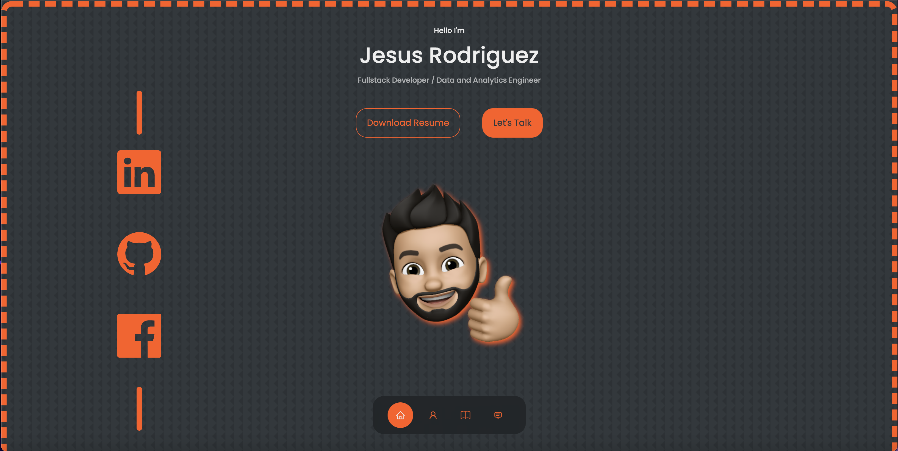

# portfolio_react_version

## Description:

- A day planner appo that allows you to add tasks for each our and save them to local storage by using a save button. The app also colors the frame of each hour block with different colors based on if the time block is in the past, present or future of that day.

## Live Page Link:

[External Link to Live Page](https://JesusRodriguezDev.github.io/portfolio_react_version)

In the project directory, you can run:

### `npm start`

Runs the app in the development mode.\
Open [http://localhost:3000](http://localhost:3000) to view it in your browser.

The page will reload when you make changes.\
You may also see any lint errors in the console.
